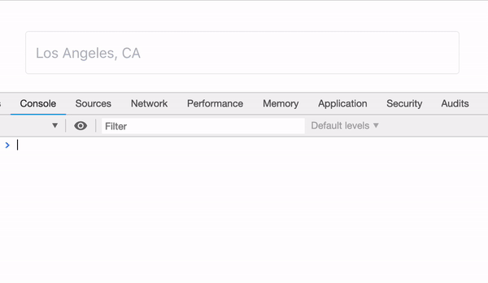

<h1 align="center">
  use-google-autocomplete ⌨️
</h1>
<p align="center" style="font-size: 1.5rem;">
  A tiny React Hook that returns Google Autocomplete results with session_token handling. 
</p>

## Problem

Google's Maps Javascript SDK gives us a default autocomplete experience, with a slightly customizable UI through class names; however, if we want to create a ground up search experience, we'll need to use their [REST API](https://developers.google.com/places/web-service/autocomplete). We want to have a hook that does something like this:

<p align="center">

</p>

The two primary things we need to focus on are:

### 1. Handle session_tokens

Every time we send a request to the REST endpoint, we need to pass a session_token in order for Google to group
shared calls together for billing purposes. Google recommends uuid4 ids, and after a bit of research, [3 minutes](https://stackoverflow.com/questions/50398801/how-long-do-the-new-places-api-session-tokens-last/50452233#50452233) is the limit for the lifetime of a session_token, though we need to refresh the session_token when we make a new query to fetch more details about a specific place.

### 2. Debounce API calls

We dont' want to be sending an API call on every single keystroke, so we'll need to debounce each
keystroke and only call the API when a user finishes typing.

## The Solution

`use-google-autocomplete` handles session_tokens by using the recommended `uuid4/v4` package to
generate unique ids, renewing every 180000ms (3 minutes), and when a user calls `getPlaceDetails()` to fetch more information regarding a specific place.

The returned values from useGoogleAutocomplete will allow us to focus on creating a custom UI.

## Usage

```
yarn add use-google-autocomplete
```

or

```
npm install use-google-autocomplete
```

```
import useGoogleAutocomplete from 'use-google-autocomplete'

const App = () => {

  // This will update each time a new `query` prop is passed.
  const { results, isLoading, error, getPlaceDetails } = useGoogleAutocomplete({
    apiKey: '<API_KEY>',
    query: 'New York',
    options: {
      types: '(cities)',
    },
  })


  return (
    <ul>
      {results.predictions.map(prediction => (
        <li key={prediction.place_id}>
          <Component prediction={prediction} />
        </li>
      })
    </ul>
  )
}
```

## Props

### apiKey

> String value of your Google API key. Make sure to enable the Maps API in your console.

### type

> String value of 'places' or 'query' | defaults to 'places'
> This will determine if we use 'autocomplete' or 'queryautocomplete' ([reference](https://developers.google.com/places/web-service/autocomplete))

### query

> String value of a search query.

### options

> Object of [Google options](https://developers.google.com/places/web-service/autocomplete)

<!-- This table was generated via http://www.tablesgenerator.com/markdown_tables -->

| property       | type     | description                                                                                        |
| -------------- | -------- | -------------------------------------------------------------------------------------------------- |
| `types`        | `string` | `(cities)`, `geocode`, `establishments`, or `address`                                              |
| `language`     | `string` | Language for results to return                                                                     |
| `location`     | `string` | `37.7749, -122.4194` or `San Francisco, CA`                                                        |
| `radius`       | number   | Results within the radius of the search (meters)                                                   |
| `strictbounds` | boolean  | Returns only those places that are strictly within the region defined by location and radius       |
| `offset`       | number   | The position, in the input term, of the last character that the service uses to match predictions. |

## Return values

### results

> Array of Google search results

### isLoading

> Boolean | True when fetching Google API data

### error

> Null or string value of the current error, if there is any.

### getPlaceDetails

> Function
> getPlaceDetails(
> placeId: string,
> placeDetailOptions: {
> fields?: string[],
> region?: string,
> language?: string
> })

This function must be used if you are trying to get more information about a place (ex;
latitude/longitude). It'll fetch the Place data and renew our session_token.
